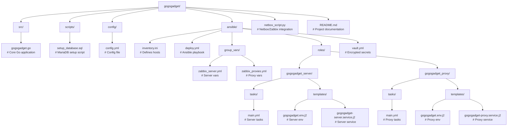
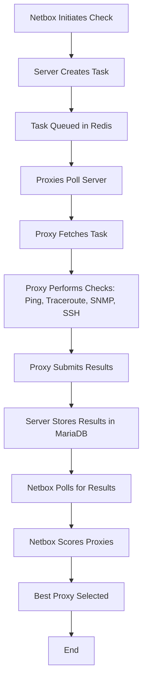

# Go Go Gadget

**Go Go Gadget** is a network reachability tool.

## Overview

Go Go Gadget is a sophisticated network monitoring system designed to assess host reachability using Zabbix proxies. It performs checks like ping, traceroute, SNMP, and SSH port status, leveraging a server-proxy architecture. The server manages tasks via HTTP endpoints, while proxies execute checks and submit results. Integration with Zabbix and Netbox provides dynamic proxy and community data, and MariaDB ensures persistent storage. Ansible automates deployment for consistency and ease.

### Key Features

- **Efficient Task Queuing**: Utilizes Redis for scalable task distribution to proxies.
- **Concurrent Checks**: Parallel SNMP checks enhance performance.
- **Robust Logging**: Structured logging with `logrus` for detailed diagnostics.
- **Flexible Scoring**: Configurable weights for proxy selection (ping: 40%, hops: 20%, SNMP: 30%, SSH: 10%).
- **Monitoring & Testing**: New endpoints `/health`, `/config`, and `/test-check` for system health and mock testing.

### Prerequisites

- **Operating System**: Ubuntu 20.04+ (server and proxies).
- **Ansible**: Version 2.9+ for deployment automation.
- **Go**: Version 1.16+ to build the application (dependencies: `go-ping`, `aeden/traceroute`, `gosnmp`, `go-sql-driver/mysql`, `sirupsen/logrus`, `go-redis`, `yaml.v3`).
- **MariaDB**: Version 10.3+ for persistent storage.
- **Redis**: Version 6.0+ for task queuing.
- **Python 3**: For Netbox integration with `pyzabbix` and `requests`.
- **SSH Access**: Required for all target hosts with sudo privileges.

## Directory Structure

```plaintext
gogogadget/
├── src/
│   └── gogogadget.go              # Core Go application for server and proxy functionality
├── scripts/
│   └── setup_database.sql         # MariaDB setup script for database initialization
├── config/
│   └── config.yml                # Configuration file for intervals and scoring weights
├── ansible/
│   ├── inventory.ini             # Defines server and proxy hosts
│   ├── deploy.yml                # Main Ansible deployment playbook
│   ├── group_vars/
│   │   ├── zabbix_server.yml     # Server-specific variables (e.g., DB credentials)
│   │   └── zabbix_proxies.yml    # Proxy-specific variables (e.g., server URL)
│   ├── roles/
│   │   ├── gogogadget_server/
│   │   │   ├── tasks/
│   │   │   │   └── main.yml      # Tasks to deploy the server
│   │   │   └── templates/
│   │   │       ├── gogogadget.env.j2         # Server environment file
│   │   │       └── gogogadget-server.service.j2  # Server systemd service
│   │   └── gogogadget_proxy/
│   │       ├── tasks/
│   │       │   └── main.yml      # Tasks to deploy proxies
│   │       └── templates/
│   │           ├── gogogadget.env.j2         # Proxy environment file
│   │           └── gogogadget-proxy.service.j2  # Proxy systemd service
│   └── vault.yml                 # Encrypted secrets file (Ansible Vault)
├── netbox_script.py              # Python script for Netbox/Zabbix integration
└── README.md                     # Project documentation (you’re reading it!)
```


## Deployment Process
### Prepare the Control Machine
### Install Dependencies:
```bash
sudo apt update
sudo apt install ansible git python3-pip -y
pip3 install pyzabbix requests
```
Ensures Ansible, Git, and Python dependencies are available for deployment and Netbox integration.
Set Up SSH Access:
```bash
ssh-copy-id ubuntu@192.168.1.10
ssh-copy-id ubuntu@192.168.1.11
ssh-copy-id ubuntu@192.168.1.12
```
Configures passwordless SSH access to target hosts for Ansible.
Step 2: Configure the Project
Create Directory Structure:
```bash
mkdir -p gogogadget/{src,scripts,config,ansible/roles/gogogadget_{server,proxy}/{tasks,templates},ansible/group_vars}
cd gogogadget
```
Sets up the project structure locally.
Update Inventory:
Edit ansible/inventory.ini with your actual server and proxy IPs and SSH usernames.
Configure Vault:
```bash
ansible-vault create ansible/vault.yml
```
Enter a secure vault password and populate with encrypted secrets (e.g., API token, DB credentials).
Copy Code:
Place all files from this document into their respective directories as outlined above.
Step 3: Test Locally (Pre-Deployment)
Build the Go Binary:
```bash
cd src
go build -o gogogadget gogogadget.go
Compiles the Go Go Gadget binary locally for testing.
Run Server Locally:
bash
export API_TOKEN=abc123xyz789
export DB_USER=gogogadget_user
export DB_PASSWORD=P@ssw0rd123!
export DB_NAME=gogogadget_db
./gogogadget --role server --port 8080 --config ../config/config.yml
```
Starts the server on localhost:8080.
Run Proxy Locally:
```bash
export API_TOKEN=abc123xyz789
export SERVER_URL=http://localhost:8080
./gogogadget --role proxy --proxy-name test-proxy --config ../config/config.yml
```
Starts a test proxy instance.
Test Endpoints:
```bash
curl -H "Authorization: Bearer abc123xyz789" -X POST -d '{"host":"8.8.8.8","communities":["public","private"]}' http://localhost:8080/start-check
curl -H "Authorization: Bearer abc123xyz789" http://localhost:8080/health
curl -H "Authorization: Bearer abc123xyz789" http://localhost:8080/config
curl -H "Authorization: Bearer abc123xyz789" -X POST -d '{"host":"test.local"}' http://localhost:8080/test-check
```
Validates basic functionality and new endpoints.
Step 4: Deploy with Ansible
Set Environment Variables:
Ensure mysql_root_password is set or stored securely (e.g., in Vault) for initial DB setup.
Execute Playbook:
```bash
cd ansible
ansible-playbook -i inventory.ini deploy.yml --ask-vault-pass --extra-vars "mysql_root_password=your-root-password"
```
Deploys the server and proxies, prompting for the Vault password.
Verify Deployment:
Server:
```bash
ssh ubuntu@192.168.1.10 "sudo systemctl status gogogadget-server"
```
Proxies:
```bash
ssh ubuntu@192.168.1.11 "sudo systemctl status gogogadget-proxy"
ssh ubuntu@192.168.1.12 "sudo systemctl status gogogadget-proxy"
```
Checks service status on all hosts.
Step 5: Post-Deployment Testing
Check Database:
```bash
ssh ubuntu@192.168.1.10 "mysql -u gogogadget_user -pP@ssw0rd123! -e 'USE gogogadget_db; SHOW TABLES;'"
```
Verifies tasks and results tables exist.
Run Netbox Script:
```bash
export GOGOGADGET_API_TOKEN=abc123xyz789
export ZABBIX_USER=Admin
export ZABBIX_PASS=zabbix
python3 netbox_script.py
```
Tests integration with Zabbix and Go Go Gadget server.
Configuration
MariaDB:
Database: gogogadget_db
User: gogogadget_user
Password: Set in vault.yml (e.g., P@ssw0rd123!)
Stored in ```/etc/gogogadget.env```
Environment Variables:
Server: API_TOKEN, DB_USER, DB_PASSWORD, DB_NAME
Proxy: API_TOKEN, SERVER_URL
Config File: ```/etc/gogogadget/config.yml``` defines polling intervals, SNMP timeouts, and scoring weights.
## Usage
### Starting a Check
### Initiate a reachability check:
```bash
curl -H "Authorization: Bearer abc123xyz789" -X POST -d '{"host":"target.example.com","communities":["public","private"]}' http://192.168.1.10:8080/start-check
```
Returns: {"task_id": "task-<timestamp>"}
Retrieving Results
Fetch results for a task:
```bash
curl -H "Authorization: Bearer abc123xyz789" http://192.168.1.10:8080/get-results?task_id=task-<timestamp>
```
Health Check
Check system status:
```bash
curl -H "Authorization: Bearer abc123xyz789" http://192.168.1.10:8080/health
```
Configuration Retrieval
View current settings:
```bash
curl -H "Authorization: Bearer abc123xyz789" http://192.168.1.10:8080/config
```
Test Check
Run a mock check:
```bash
curl -H "Authorization: Bearer abc123xyz789" -X POST -d '{"host":"test.local"}' http://192.168.1.10:8080/test-check
```
Process Flowchart

## Flowchart Explanation
1. Netbox Initiates Check: Netbox sends a POST request to /start-check with host and SNMP communities.
2. Server Creates Task: A unique task ID is generated and stored in MariaDB.
3. Task Queued in Redis: Task ID is pushed to a Redis queue for proxy pickup.
4. Proxies Poll Server: Proxies periodically request tasks via /get-task.
5. Proxy Fetches Task: A proxy retrieves a task ID and details from the server.
6. Proxy Performs Checks: Executes ping, traceroute, SNMP (in parallel), and SSH checks.
7. Proxy Submits Results: Sends results to /submit-result.
8. Server Stores Results: Results are saved in MariaDB, task marked complete.
9. Netbox Polls for Results: Queries /get-results until data is available.
10. Netbox Scores Proxies: Applies weighted scoring (ping: 40%, hops: 20%, SNMP: 30%, SSH: 10%).
11. Best Proxy Selected: Identifies the top-scoring proxy for monitoring.
12. End: Process completes with the best proxy selected.
# Troubleshooting
## Logs:
- Server:
```bash
tail -f /var/log/gogogadget.log
```
(check for "Go-go Gadget" Easter egg on startup!)
- Proxy: Same log file, look for proxy-specific messages.
- MariaDB:
Verify connection: ```mysql -u gogogadget_user -pP@ssw0rd123! -e "SELECT 1;"```
- Redis:
- Check queue:
```bash
redis-cli -h localhost -p 6379 llen task_queue
```
- Service Status:
```bash
sudo systemctl status gogogadget-server
```
```bash
sudo systemctl status gogogadget-proxy
```
## Security Notes
Credentials: Store API tokens and DB passwords in vault.yml, encrypted with a strong vault password.
## Firewall: Ensure only port 8080 is open (sudo ufw allow 8080/tcp).
Access Control: Restrict SSH access to trusted IPs and use key-based authentication.
## Easter Eggs
Go-go Gadget Startup: Check the server logs for a "Go-go Gadget monitoring!" message on startup.
GadgetScope Activation: The server logs "Activating GadgetScope for network surveillance!" when starting.
Speed Boost Comment: In performChecks, find the "Go-go Gadget speed boost" comment in the SNMP section.
